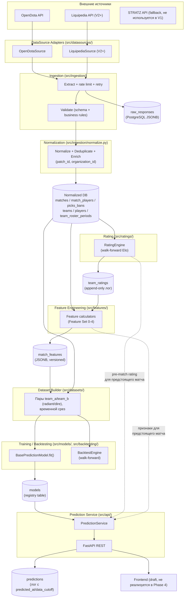
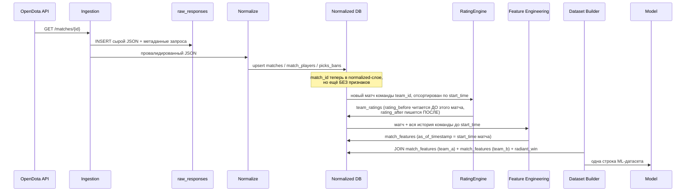
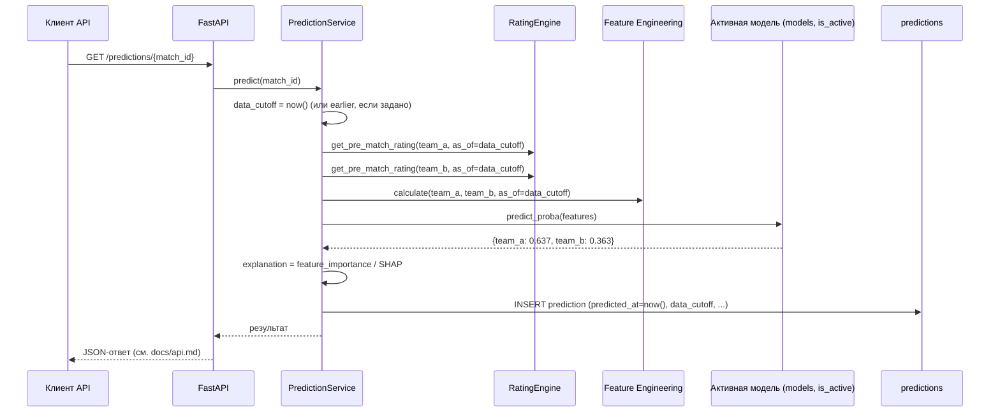

# PHASE 4 — Architecture

## 0. Критическая оценка стартовой схемы из задания

Предложенная в задании 10-слойная цепочка (`External Sources → Ingestion →
Raw → ETL → Normalized DB → Feature Engineering → Feature Dataset → Training
→ Model Registry → Prediction API → Frontend`) — разумная отправная точка,
но два уточнения по итогам Phase 1-3:

1. **`RatingEngine` — отдельный компонент, не растворён в "Feature
   Engineering".** Он используется в ТРЁХ разных контекстах (построение
   train-датасета, backtesting, live-инференс), и критично, чтобы во всех
   трёх он был **одним и тем же кодом**, а не тремя независимыми
   реализациями формулы Elo — иначе возникает classic training/serving
   skew (в проде рейтинг считается чуть иначе, чем при обучении, и модель
   тихо деградирует). Поэтому `RatingEngine` вынесен на диаграмме отдельным
   блоком, вызываемым и из ingestion/feature pipeline, и из prediction
   service.
2. **"Model Registry" и "Feature Dataset" не отдельная инфраструктура, а
   таблицы в той же PostgreSQL** (`models`, `match_features` — см.
   `docs/database-design.md`). Задание прямо предупреждает не добавлять
   MLflow/промышленный Feature Store раньше необходимости (ADR-004) — на
   диаграмме это показано явно, а не подразумевается.

## 1. System architecture (логические слои)



## 2. Data flow (жизненный цикл одного матча)



## 3. Prediction flow (прогноз ДО начала предстоящего матча)



Критический принцип задания ("если остановить время перед началом матча,
могла ли система знать эту информацию?") реализован буквально: и
training-путь (Data flow), и serving-путь (Prediction flow) вызывают ОДИН
И ТОТ ЖЕ `RatingEngine.get_pre_match_rating(team_id, as_of=...)` и один и
тот же код Feature Engineering — различается только то, что `as_of`
подставляется (исторический `start_time` при обучении, `data_cutoff`
~= `now()` при live-прогнозе), а не логика расчёта.

## 4. Развёртывание (MVP, не финальный prod)

Один `docker-compose.yml`, три сервиса: `api` (FastAPI), `postgres`,
`ingestion` (тот же образ, что `api`, но запускается как scheduled job —
`cron` внутри контейнера или внешний scheduler хоста, не отдельный
оркестратор). Никаких Kubernetes/Celery/Airflow на MVP — прямое следствие
принципа "не добавлять инфраструктуру ради красоты" (раздел 3 исходного
общего задания).

## 5. Project structure

```text
src/
  api/              # FastAPI приложение, роутеры, Pydantic response-схемы (docs/api.md)
  config.py         # DATA_START_DATE, TRAIN_START, ... — см. раздел Configuration ниже
  datasources/       # интерфейс DataSource + адаптеры (base.py уже существует; opendota.py, liquipedia.py — Phase 5)
  ingestion/          # extract/validate/normalize/checkpoint (docs/data-pipeline.md)
  identity/             # team identity resolution (docs/team-identity.md)
  repositories/          # доступ к БД, изолирует SQL от остального кода
  ratings/                # RatingEngine (walk-forward Elo, ADR-003)
  features/                # Feature Set 0-4 калькуляторы (docs/features.md)
  datasets/                 # Dataset Builder — сборка ML-датасета из match_features
  models/                    # BasePredictionModel + реализации (elo_baseline, logreg, catboost)
  backtesting/                # BacktestEngine (walk-forward, docs/backtesting.md)
  evaluation/                   # метрики, calibration (Phase 8+)

tests/
  unit/               # RatingEngine, feature calculations, identity resolution
  integration/          # datasource adapters (против фикстур, не live API), репозитории/БД
  data/                    # schema validation, duplicates, impossible values
  ml/                        # leakage checks, детерминированность датасета, sum(probabilities)==1

scripts/              # verify_data_source.py, elo_prototype.py — уже существуют
docs/                 # вся документация проекта
docker/               # Dockerfile, docker-compose.yml
migrations/           # Alembic migrations (см. Technology stack)

.env.example           # шаблон конфигурации, БЕЗ реальных секретов
```

**Ключевое правило структуры** (прямое требование задания, раздел 22):
domain-логика (`ratings/`, `features/`, `identity/`, `datasets/`,
`models/`) не импортирует ничего из `datasources/*_impl` конкретных
адаптеров — только унифицированные структуры из `datasources/base.py`.
Это уже физически заложено в Phase 2 (`src/datasources/base.py`) и
проверяется на уровне code review / линтера импортов (Phase 5+), не только
декларируется.

## 6. Technology stack

| Слой | Технология | Почему | Альтернатива | Почему не альтернатива |
|---|---|---|---|---|
| Backend API | **FastAPI** | Нативная интеграция с Pydantic (та же валидация, что нужна для `match_features` JSONB и API-схем), автогенерация OpenAPI, async из коробки (полезно при параллельных вызовах внешних API в ingestion) | Flask | Требует отдельных библиотек для валидации/OpenAPI (marshmallow/webargs) — больше boilerplate за тот же результат |
| | | | Django (+ DRF) | Тяжеловесен для API-first сервиса без сложной admin-панели и множества CRUD-сущностей с правами доступа — оверинжиниринг для MVP |
| Data processing | **pandas** | См. ADR-004 | Polars | См. ADR-004 (отложено, не отклонено) |
| ML (baseline) | **scikit-learn** | Стандарт индустрии, `LogisticRegression`/`RandomForestClassifier` из коробки, единообразный `predict_proba` API, на который опирается `BasePredictionModel` | statsmodels (только логрег) | Не даёт единого API с остальными моделями, менее удобен для сравнения |
| ML (boosting) | **CatBoost** | См. ADR-004 | LightGBM/XGBoost | См. ADR-004 (кандидаты для Phase 8 сравнения) |
| Explainability | **SHAP** | Единый API объяснимости и для sklearn, и для CatBoost — нужно ровно одной зависимостью покрыть все модели из сравнения | Built-in feature_importance каждой библиотеки отдельно | Разные модели дают несопоставимые по методологии importance — SHAP даёт единую, сравнимую метрику для explanation в API-ответе |
| База данных | **PostgreSQL** | См. ADR-002 (JSONB, транзакционность, один движок) | MySQL | Слабее поддержка JSONB и range-типов, которые нужны для temporal-запросов ростера |
| | | | SQLite | Не годится для конкурентного доступа ingestion + API одновременно |
| | | | MongoDB | Схема принципиально реляционная (FK между matches/teams/players/predictions) — документная БД боролась бы с этим, а не помогала |
| Query/Schema layer | **SQLAlchemy Core + Alembic** | Core (не полный ORM) даёт типизированные определения схемы, совпадающие с `docs/database-design.md`, но БЕЗ ленивой загрузки связей — критично, т.к. temporal-запросы ростера/рейтинга требуют явного контроля над тем, какой именно SQL выполняется, а ORM-магия рискует незаметно сломать point-in-time корректность (N+1 запросы, скрытые JOIN не туда) | Полный ORM (SQLAlchemy ORM/Django ORM) | Удобство ценой прозрачности запросов — неприемлемый компромисс именно там, где leakage-риск завязан на точность SQL (см. `docs/data-leakage.md`) |
| | | | Сырые SQL-файлы без Alembic | Нет отслеживания версий схемы/отката — усложняет reproducibility (раздел 17 общего задания) |
| Валидация данных | **Pydantic** | Общая библиотека с FastAPI, используется и для API-схем, и для schema validation в ingestion (`docs/data-pipeline.md`) | marshmallow / cerberus | Не даёт единой связки с FastAPI, лишняя вторая библиотека валидации в проекте |
| Тестирование | **pytest** | `parametrize` удобен для проверки множества feature-калькуляторов на разных входах, богатая fixture-система для БД/датасет-фикстур | unittest (stdlib) | Больше boilerplate, слабее поддержка параметризации |
| Контейнеризация | **Docker + docker-compose** | Уже доступен в среде разработки, минимальная кривая обучения, достаточно для MVP-топологии (раздел 4 выше) | Kubernetes | Оверинжиниринг для однохостового MVP без требований по автоскейлингу |
| Frontend (draft, не строится в Phase 4) | **React / Next.js** | SSR полезен для страницы "Upcoming Matches" (SEO/скорость первой загрузки не критичны для MVP, но Next.js даёт это бесплатно), большая экосистема компонентов для графиков вероятности | Plain React (Vite) | Не отклонено жёстко — разница непринципиальна для черновика; Next.js выбран как чуть более полный "batteries included" вариант |

## 7. Configuration management

`.env` + `.env.example` (шаблон без секретов, коммитится; `.env` — в
`.gitignore`, уже добавлен). Секреты (`STEAM_API_KEY`, `OPENDOTA_API_KEY`,
`DATABASE_URL` с паролем) — только через переменные окружения, никогда не
хардкодятся и не коммитятся. `src/config.py` — Pydantic `BaseSettings`,
читает `.env`, валидирует типы (даты как `date`, не строки) при старте
приложения — ошибка конфигурации обнаруживается сразу при запуске, не
посреди ночного ingestion-рана.

Параметры из требования раздела 1 этой фазы (`DATA_START_DATE` и т.д.) —
реализованы в `src/config.py` (см. итоговый список файлов Phase 4).

## 8. Testing architecture

| Категория | Что покрывает | Примеры |
|---|---|---|
| **Unit** | Чистые функции без I/O | `RatingEngine` (включая `assert_leakage_safe`-подобные тесты, уже есть прототип), калькуляторы признаков (`docs/features.md`), identity resolution правила (`docs/team-identity.md`), функция расчёта вероятности |
| **Integration** | Взаимодействие с внешними системами | `OpenDotaSource` против сохранённых фикстур ответов (не против живого API — детерминированность тестов), репозитории против тестовой БД (testcontainers/Docker Postgres) |
| **Data** | Качество данных в БД | schema validation, дубликаты, "невозможные" значения (`duration <= 0`, `start_time` в будущем), доля пропусков сверх ожидаемой |
| **ML / leakage** | Специфичные для этого проекта риски | детерминированность генерации датасета (тот же вход → тот же датасет), `sum(team_a_probability, team_b_probability) == 1`, **explicit leakage test**: для случайной выборки матчей — пересчитать признаки с искусственно "урезанной" историей (только матчи до `t`) и сверить с тем, что хранится в `match_features` — расширение подхода уже проверенного в `scripts/elo_prototype.py` на весь feature engineering слой, не только Elo |

## 9. Observability (MVP-уровень)

Structured logging (см. `docs/data-pipeline.md`) + три специфичных для
ML-сервиса лога: `ingestion_runs` (свежесть данных), `predictions`
(включая `model_version`, `predicted_at`, `data_cutoff` — уже часть схемы
БД), и application-level error tracking (стандартный Python logging в
stdout/stderr, агрегируемый средствами хостинга — не отдельный
Sentry/Prometheus/Grafana на MVP, прямое требование раздела 25 общего
задания). Path эволюции (не реализуется сейчас): экспорт метрик из
`predictions`/`ingestion_runs` в Prometheus, если/когда появится
операционная необходимость мониторить это отдельно от прямых SQL-запросов.

## 10. Security (MVP-уровень)

- Секреты — только через переменные окружения (`config.py` выше), `.env` в
  `.gitignore`.
- API-валидация входных данных — Pydantic на границе FastAPI (защита от
  некорректных `match_id`, SQL-injection через параметризованные запросы
  SQLAlchemy Core, не строковую конкатенацию SQL).
- Разделение credentials: БД-пользователь для `api` (read-only на
  предсказания/чтение) и для `ingestion` (write) — разные учётные записи
  Postgres, минимизация blast radius при компрометации одного сервиса.
  (Реализация — Phase 5, здесь фиксируется как требование.)
- Rate limiting для внешних API — уже спроектировано в `docs/data-pipeline.md`
  (token bucket в адаптере) — не только вежливость к источнику, но и защита
  от случайного исчерпания дневной квоты (`API_FREE_LIMIT`, `VERIFIED`
  из `docs/data-sources.md`) из-за бага в retry-логике.
- Безопасная обработка внешних ответов: `response_body` из источников —
  untrusted content до прохождения Validate-стадии; не выполняется как
  код, не интерполируется в SQL/shell напрямую.

## 11. Frontend (только архитектурный черновик, не реализуется в Phase 4)

Основные страницы:

1. **Upcoming Matches** — список предстоящих матчей (`GET /matches/upcoming`),
   карточка на матч: команды, турнир, время начала.
2. **Match Prediction** — детальная страница одного матча
   (`GET /predictions/{match_id}`): `team_a.probability`/`team_b.probability`
   как прогресс-бар или донат-диаграмма (не только числа — задание явно
   требует наглядность), `confidence` — текстовая метка (low/medium/high) с
   визуальным индикатором, `explanation` — список факторов со знаком
   (+/-) и величиной влияния, как в примере из задания ("Main factors").
   Если доступен draft-aware прогноз для этого матча — переключатель
   "до драфта / после драфта" с явной разницей в процентах.
3. **Team page** — `GET /teams/{team_id}` + `GET /teams/{team_id}/form`:
   текущий рейтинг, график формы (recent_winrate/EMA во времени),
   текущий состав (`team_roster_periods`, активный на сегодня).

API contract для всех страниц — `docs/api.md`. Данные отображаются как
готовые JSON-поля ответа API — фронтенд не делает собственных вычислений
вероятности/confidence, только рендерит то, что вернул `PredictionService`
(разделение ответственности: вся ML-логика — на бэкенде).

## 12. Эволюция V1 → V5

| Версия | Добавляется | Что меняется в архитектуре | Что НЕ меняется |
|---|---|---|---|
| **V1 (текущий MVP)** | Team + Elo + Recent Form + Patch (Feature Set 0-1) | Базовый набор всех слоёв выше, только `OpenDotaSource` | — |
| **V2** | + Players, Roster (Feature Set 2) | Реконструкция ростера (`docs/team-identity.md`) входит в Enrichment; опционально подключается `LiquipediaSource` (второй адаптер `DataSource`, без изменения интерфейса) | Схема БД уже содержит `team_roster_periods`/`players` (спроектированы в Phase 4, не в V2) — миграция не нужна, только наполнение данными |
| **V3** | + Hero statistics (Feature Set 3, частично) | Новый feature-калькулятор в `src/features/`, возможно материализация `/heroStats` в отдельную таблицу-кэш | Dataset Builder/Model/API не меняются — новые признаки просто добавляются в `match_features.features` JSONB под новым `feature_set_version` |
| **V4** | + Draft-aware prediction (Feature Set 4) | **Единственное по-настоящему архитектурное изменение**: `PredictionService` получает второй режим (`mode=pre_draft \| draft_aware`), `predictions` уже имеет поле под это (см. `docs/api.md`); может потребоваться вторая обученная модель (`models` таблица уже поддерживает множество версий) | Схема БД (`picks_bans` уже спроектирована в Phase 4), `RatingEngine`, ingestion — без изменений |
| **V5** | Live/in-game prediction | Новый `DataSource` для live-состояния игры (Game State Integration/spectator API — отдельное исследование источников, вне текущего скоупа), вероятно новый тип модели (последовательные данные — не табличный CatBoost, а модель, работающая с временными рядами игры) | Принцип "prediction uses only data available before the moment of prediction" не меняется — просто "момент" становится не `start_time` матча, а произвольная точка внутри игры; `predictions.data_cutoff` уже спроектирован достаточно общим, чтобы это выразить без изменения схемы |

Архитектурное свойство, которое это обеспечивает: ни одно решение Phase 4
(схема БД, интерфейс `DataSource`, `RatingEngine`, `BasePredictionModel`)
не жёстко привязано к V1 — расширение до V4 не требует ломающих изменений
уже спроектированных таблиц, только новых данных и новых калькуляторов
поверх той же структуры.
