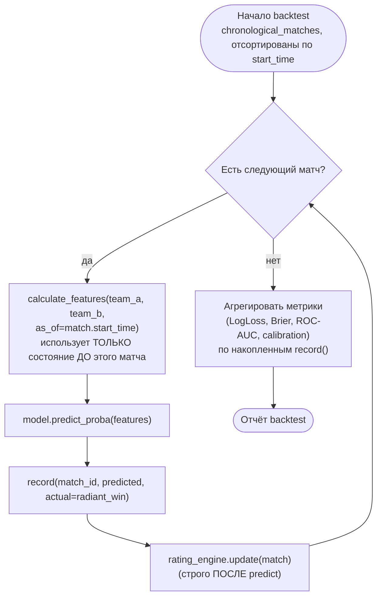

# PHASE 4 — Backtesting Engine

## Зачем отдельный компонент

Backtesting — не просто "оценка на test-срезе", а имитация продового режима
работы системы шаг за шагом во времени (ADR-005). Это одна из центральных
частей системы (прямая формулировка задания), поэтому выделена в отдельный
компонент `BacktestEngine` (`src/backtesting/engine.py`), переиспользующий
тот же `RatingEngine` и те же feature-калькуляторы, что и
training/serving-пути (см. `docs/architecture.md`, принцип единого кода для
`as_of`-зависимых вычислений).

## Концептуальный алгоритм

```text
for match in chronological_matches (start_time возрастает):

    features = calculate_features(match.team_a, match.team_b, as_of=match.start_time)
    # calculate_features ЧИТАЕТ текущее состояние RatingEngine/истории,
    # накопленное только по матчам ДО этого

    prediction = model.predict_proba(features)

    record(match_id, prediction, actual=match.radiant_win)

    rating_engine.update(match)   # ТОЛЬКО ПОСЛЕ predict — иначе прогноз
                                   # этого матча использовал бы его же исход

    continue
```

**Ключевой порядок операций** (частая ошибка, если не зафиксировать явно):
`predict` строго ДО `rating_engine.update` для того же матча. Обновление
состояния — последний шаг итерации, не первый.

## Диаграмма



## Режимы запуска

| Режим | Когда переобучается модель | Назначение |
|---|---|---|
| **Fixed-model backtest** | Модель обучена один раз (на `TRAIN_START`..`VALIDATION_START`), дальше только предсказывает по растущей истории признаков | Быстрая проверка "работает ли механизм walk-forward предсказаний корректно" (в первую очередь — тест на отсутствие утечки, не оценка качества переобучаемой системы) |
| **Rolling retraining backtest** | Модель периодически переобучается (например, раз в квартал/патч) на всех данных до текущей точки | Реалистичная имитация production-режима — именно эта схема даёт финальные метрики качества для отчёта Phase 8 |

Частота переобучения в rolling-режиме — параметр конфигурации
(`BACKTEST_RETRAIN_INTERVAL`), не хардкод — конкретное значение подбирается
эмпирически в Phase 8 (компромисс между реализмом и вычислительной
стоимостью многократного переобучения CatBoost).

## Что проверяет BacktestEngine, помимо качества модели

1. **Leakage smoke test.** Тот же принцип, что в `scripts/elo_prototype.py`
   (`assert_leakage_safe`), но на уровне всего pipeline: для случайной
   подвыборки матчей — независимый пересчёт признаков "как будто это
   единственный матч в истории на эту дату" должен совпасть с тем, что
   вычислено в основном проходе backtest.
2. **Стабильность качества по времени**, не только средняя метрика — то,
   что невозможно получить из единственного train/val/test среза (ADR-005):
   график Log Loss/Brier по времени должен показывать, деградирует ли
   модель к концу test-периода (признак дрифта — новый patch/meta, см.
   `docs/architecture.md`, Observability).
3. **Разбивка метрик по срезам** (раздел 20 общего задания, "проверка
   статистической значимости"): по турниру, по патчу, по силе команд —
   `BacktestEngine.report()` обязан уметь агрегировать не только "в целом",
   но и по этим измерениям, иначе высокая средняя accuracy может маскировать
   провал на конкретных типах матчей (например, матчи с сильной сменой
   состава — прямая проверка гипотезы задания про roster).

## Интерфейс (реализация — `src/backtesting/engine.py`, скелет)

```text
BacktestEngine(
    model: BasePredictionModel,
    rating_engine: RatingEngine,
    feature_calculators: list[FeatureCalculator],
    matches: Iterable[Match],           # уже отсортированы по start_time
)

.run() -> BacktestReport
    # report.predictions: list[(match_id, predicted_proba, actual)]
    # report.metrics: dict (общие + по срезам патч/турнир/сила команд)
    # report.calibration_curve: ...
```

Полная реализация (реальные метрики, реальная интеграция с БД) — Phase 8,
не Phase 4. Здесь зафиксирован контракт и алгоритм, проверенный на уровне
чистой функции без I/O (совместимо с уже написанным
`scripts/elo_prototype.py`, который де-факто является backtesting Elo в
миниатюре).
