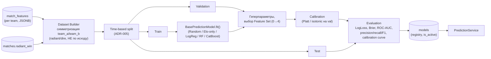

# PHASE 4 — ML Architecture

## Pipeline



## Dataset Builder

Строит одну строку ML-датасета из двух строк `match_features` (radiant и
dire для одного `match_id`, см. `docs/database-design.md`) плюс
`matches.radiant_win`. Ключевые правила:

- **Симметризация без утечки исхода.** Столбцы называются по игровой роли
  (`radiant_*`/`dire_*`), НЕ по "фавориту"/"победителю" — иначе сам порядок
  столбцов кодирует целевую переменную (см. `docs/database-design.md`,
  раздел `match_features`, дизайн-решение). Целевая переменная —
  `radiant_win` (уже существует в `matches`, не вычисляется заново).
- **Только один `feature_set_version` за раз.** Датасет строится под
  конкретную версию набора признаков — сравнение Feature Set 0 vs 1 vs 2
  (`docs/features.md`) — это два РАЗНЫХ прогона Dataset Builder, не одна
  широкая таблица со всеми версиями сразу.
- **Детерминированность.** Тот же `(feature_set_version, MIN_MATCH_DATE,
  DATA_END_DATE)` обязан давать побитово тот же датасет при повторном
  запуске — требование reproducibility и явный ML-тест
  (`docs/architecture.md`, раздел Testing).
- **Пропуски не удаляются молча.** Строки с `NaN`/`insufficient_history`
  флагами (см. `docs/features.md`) остаются в датасете — обработка
  пропусков (imputation vs встроенная поддержка NaN в CatBoost) — параметр
  конкретной модели, не Dataset Builder.

## Time-based split и Walk-forward

Уже решено в ADR-005: split — строго по времени
(`TRAIN_START`/`VALIDATION_START`/`TEST_START` из `src/config.py`), финальная
оценка — через `BacktestEngine` (`docs/backtesting.md`), а не единственный
срез. Единственный срез используется только как быстрый "smoke test" при
разработке (секунды/минуты, не полный backtest).

## Модели для сравнения (Phase 8, здесь — только интерфейс)

| Модель | Роль | Обучаемая? |
|---|---|---|
| Random baseline | Нижняя граница | Нет (детерминированная случайность с фиксированным seed) |
| "Всегда сильнее по Elo" | Простейший небезосновательный baseline | Нет (правило поверх `RatingEngine`, не ML) |
| Logistic Regression | Baseline, интерпретируемый | Да |
| Random Forest | Промежуточный по сложности | Да |
| CatBoost (основной кандидат, ADR-004) | Ожидаемо лучший baseline на табличных данных умеренного объёма | Да |
| LightGBM / XGBoost | Кандидаты для сравнения с CatBoost | Да |

Все — за одним интерфейсом `BasePredictionModel` (`src/models/base.py`),
поэтому "Random baseline" и "CatBoost" пробегают через ОДИН И ТОТ ЖЕ
Evaluation/Calibration/Backtesting код — сравнение получается честным
(одинаковые данные, одинаковые метрики, единственная переменная — сама
модель).

## Calibration

Выполняется ПОСЛЕ подбора модели, на validation-срезе (не на train — иначе
переобучение калибровки), ДО финальной оценки на test. `BasePredictionModel`
имеет метод `calibrate(X_val, y_val)`, применяемый опционально поверх уже
обученной модели (Platt scaling — `sklearn.linear_model.LogisticRegression`
поверх сырых предсказаний, или `sklearn.isotonic.IsotonicRegression` —
выбор метода сравнивается эмпирически в Phase 8-9, не решается здесь
заранее).

## Model Registry — таблица `models`, не MLflow

Обоснование — ADR-004. Поля таблицы (`docs/database-design.md`) достаточны
для MVP: версия, алгоритм, `feature_set_version`, границы
train/val/test, `config`/`metrics` как JSONB, `artifact_path` (сериализованная
модель — `joblib`/CatBoost native format на файловой системе или в том же
Postgres как `bytea`, решение — Phase 8, не блокирует архитектуру),
`is_active` — какая модель сейчас обслуживает `PredictionService`.

## Prediction Service

Единственный компонент, вызываемый API (`docs/api.md`). Обязанности:

1. Прочитать `is_active` модель из `models`.
2. Вызвать `RatingEngine`/`Feature Engineering` с `as_of=data_cutoff` (тот же
   код, что в training — см. `docs/architecture.md`, Data flow vs
   Prediction flow).
3. `model.predict_proba(features)`.
4. Собрать `explanation` (SHAP/feature importance поверх той же модели).
5. Записать строку в `predictions` (аудиторский след, раздел 19 задания).

## BasePredictionModel — интерфейс

Реализован как ABC в `src/models/base.py` (см. итоговый список файлов ниже,
раздел PHASE 4 SUMMARY). Контракт:

```text
fit(X_train, y_train) -> None
predict_proba(X) -> np.ndarray[n_samples, 2]   # [:, 1] = P(radiant_win)
calibrate(X_val, y_val) -> None                 # опционально, no-op по умолчанию
evaluate(X_test, y_test) -> dict[str, float]    # log_loss, brier, roc_auc, accuracy
save(path) -> None
load(path) -> BasePredictionModel               # classmethod
feature_importance() -> dict[str, float] | None # None, если модель не поддерживает
```

Единообразный `predict_proba` (не только `predict`) — прямое требование
задания (раздел 15): "нужно иметь возможность сравнивать ELO / LogReg /
CatBoost / LightGBM, не переписывая pipeline", и вероятности, а не только
класс-победитель, нужны для Log Loss/Brier/calibration.
