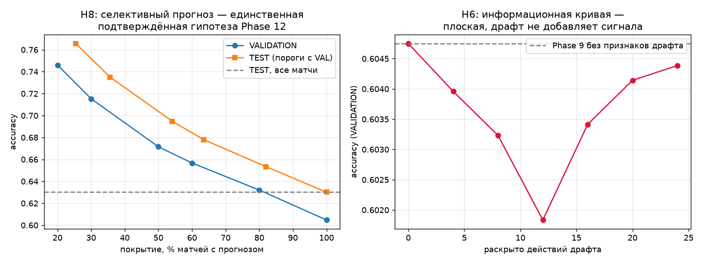

# PHASE 12 — итоги: draft-aware прогноз, состояние меты и неопределённость

> Аудит и гипотезы — `reports/phase12-draft-feasibility.md` (сформулированы
> **до** экспериментов). Сырые числа — `reports/experiments/phase12.json`.
> Отбор признаков проводился **только на VALIDATION**; к TEST было
> **ровно одно обращение**, зафиксированное в JSON (`test_accesses: 1`).

**Результат фазы в одну строку: четыре гипотезы о драфте опровергнуты,
пятая (информационная кривая) опровергнута тоже, а единственный
подтверждённый результат — селективный прогноз — не требует ни одного
нового признака.**

---

## 1. Выборка и протокол

| | |
|---|---:|
| Матчей с 10 игроками, полным драфтом и действиями | 116 236 |
| Форматы драфта | `cm_post_734`=58 116, `cm_pre_734`=57 672, **не-CM=448 (отсеяны)** |
| Строк после исключения team cold-start и не-CM | 109 754 |
| TRAIN / VALIDATION / TEST | 76 827 / 16 463 / 16 464 |
| Формат в VAL и TEST | `cm_post_734` — **100%** |
| Обращений к TEST | **1** |

Frozen baseline (Elo K=16 + Form3) и KEEP-набор Phase 9 не менялись.
Порог отбора — Δlog loss > 1e-4 (ужесточён после Phase 9, где слишком
мягкий порог впустил признак с нулевым эффектом).

---

## 2. Проверка невырожденности признаков — до интерпретации результата

Первый прогон дал Δlog loss = 0.00000 у **всех** признаков фазы, ровно
как у negative control из чистого шума. Одинаковый log loss до четвёртого
знака у семи моделей — типичная картина сломанного признака, а не
отсутствия сигнала. Поэтому перед тем как записывать это как результат,
измерены сами признаки (TRAIN+VAL, TEST не затрагивался):

| Признак | std | доля ≠ 0 | corr с исходом |
|---|---:|---:|---:|
| `denied_comfort_diff` | 0.0656 | 99.9% | **+0.0049** |
| `denied_comfort_top_diff` | 0.1649 | 93.9% | **−0.0054** |
| `order_weighted_hero_strength_diff` | 0.0200 | 100% | +0.0949 |
| `last_pick_counter_diff` | 0.0300 | 100% | +0.0643 |
| `lane_balance_diff` | 0.8348 | 100% | −0.0004 |
| `lane_prior_entropy_diff` | 0.2254 | 100% | +0.0118 |

Признаки невырождены: ненулевая дисперсия, почти везде ненулевые
значения. **Отрицательный результат настоящий, а не дефект кода.**

---

## 3. Эксперименты на VALIDATION

| Эксперимент | Accuracy | Log Loss | ROC-AUC | Δacc | Δlog loss |
|---|---:|---:|---:|---:|---:|
| **E0: Phase 9 (контроль)** | 0.6048 | 0.6532 | 0.6536 | — | — |
| E1 H1: + denied_comfort | 0.6029 | 0.6532 | 0.6534 | −0.0018 | −0.00000 |
| E2 H1: + denied_comfort_top | 0.6040 | 0.6532 | 0.6536 | −0.0007 | −0.00000 |
| E3 H2: + order_weighted_hero | 0.6045 | 0.6532 | 0.6536 | −0.0002 | +0.00000 |
| E4 H3: + last_pick_counter | 0.6062 | 0.6531 | 0.6537 | +0.0015 | −0.00004 |
| E5 H4: + lane_composition | 0.6057 | 0.6533 | 0.6535 | +0.0010 | +0.00006 |
| E6: все признаки Phase 12 | 0.6044 | 0.6532 | 0.6533 | −0.0004 | +0.00003 |
| **E7: negative control (шум)** | 0.6050 | 0.6532 | 0.6536 | +0.0002 | −0.00000 |

**E7 — ключевая строка отчёта.** Признак из чистого шума даёт ровно тот
же результат, что и все содержательные признаки фазы. Это и есть мера
того, насколько они пусты: не «слабый эффект», а неотличимо от шума.

Ни один признак не прошёл порог. Зафиксированный набор Phase 12
**тождественен набору Phase 9**.

---

## 4. H1 — самая интересная из опровергнутых

H1 была единственной гипотезой, у которой **до всякого моделирования**
было свидетельство в данных: бан попадает в top-10 пула соперника в
23.09% случаев против 12.34% для собственного пула (случайный baseline
7.94%) — разрыв в 1.87 раза, не объяснимый популярностью героя.

Свидетельство подтвердилось и осталось верным. Но предсказательного
содержания в нём нет: корреляция доли вырезанного пула с исходом
**+0.005**, а у второй формулировки признака знак вообще обратный
(**−0.005**).

Разделение здесь принципиальное и стоит того, чтобы его назвать явно:
**команды действительно банят комфортных героев соперника — и это
действительно не влияет на то, кто выиграет.** Наиболее правдоподобное
объяснение: на профессиональном уровне пул глубок настолько, что шесть
банов его не пробивают, и обе стороны делают это симметрично, так что
эффекты гасят друг друга. Проверка этого объяснения — отдельная работа,
здесь она не проводилась, и выводов о причинах отчёт не делает.

---

## 5. H2/H3 — не пусты, но избыточны

`order_weighted_hero_strength` (corr **+0.095**) и `last_pick_counter`
(corr **+0.064**) имеют реальную маргинальную связь с исходом — заметно
большую, чем H1. И при этом дают Δlog loss на уровне 0.

Это уже знакомая проекту картина: признак коррелирует с исходом, но вся
его информация уже содержится в `hero_exp_decay_diff` и Elo. То же самое
Phase 9 обнаружила для агрегаций player-Elo, Phase 10 — для канонической
идентичности команд, Phase 11 — для player×hero. **Phase 12 — четвёртое
подряд подтверждение одного и того же потолка.**

---

## 6. H6 — информационная кривая плоская

Признаки состояния драфта строились при разном объёме раскрытия
(`reveal = k` действий), в одном walk-forward проходе на каждое значение:

| Раскрыто действий | Accuracy (VAL) | Log Loss |
|---|---:|---:|
| 0 (драфт не начался) | **0.6048** | 0.6532 |
| 4 | 0.6040 | 0.6533 |
| 8 | 0.6032 | 0.6532 |
| 12 | 0.6018 | 0.6532 |
| 16 | 0.6034 | 0.6533 |
| 20 | 0.6041 | 0.6532 |
| весь драфт (24) | 0.6044 | 0.6532 |

Гипотеза предсказывала рост со скачками на пиках. Наблюдается **плоская
кривая**, причём максимум — при нуле раскрытых действий. Разброс
(0.6018…0.6048) лежит внутри шума и не имеет монотонности.

**Ответ на вопрос «сколько информации добавляет наблюдение драфта»: в
рамках построенных признаков — нисколько.** Оговорка обязательна:
опровергнут не тезис «драфт не важен», а тезис «эти признаки состояния
драфта дают прирост поверх Phase 9».

---

## 7. H7 — резерва в калибровке нет, потому что модель уже откалибрована

| Бин | n (VAL) | Средний прогноз | Факт |
|---|---:|---:|---:|
| [0.1, 0.2) | 287 | 0.1644 | 0.1289 |
| [0.2, 0.3) | 976 | 0.2579 | 0.2674 |
| [0.3, 0.4) | 2 570 | 0.3575 | 0.3669 |
| [0.4, 0.5) | 4 409 | 0.4529 | 0.4663 |
| [0.5, 0.6) | 4 431 | 0.5468 | 0.5502 |
| [0.6, 0.7) | 2 492 | 0.6415 | 0.6388 |
| [0.7, 0.8) | 992 | 0.7419 | 0.7228 |
| [0.8, 0.9) | 273 | 0.8343 | 0.8462 |

**ECE = 0.0091 на VALIDATION, 0.0207 на TEST.**

Предположение Phase 11 («резерв не в дискриминации, а в качестве
вероятностей») **не подтвердилось**: улучшать нечего, вероятности уже
согласованы с частотами. Это тоже отрицательный результат, и он снимает
с повестки целое направление.

---

## 8. H8 — единственная подтверждённая гипотеза

Порог уверенности `|p − 0.5|` выбран на VALIDATION и **зафиксирован**;
на TEST применены ровно те же числовые пороги.

| Порог (с VAL) | Покрытие VAL | Accuracy VAL | Покрытие TEST | n | **Accuracy TEST** |
|---|---:|---:|---:|---:|---:|
| 0.0000 | 100.0% | 0.6048 | 100.0% | 16 464 | **0.6301** |
| 0.0337 | 80.0% | 0.6320 | 82.0% | 13 502 | **0.6534** |
| 0.0701 | 60.0% | 0.6567 | 63.5% | 10 451 | **0.6780** |
| 0.0912 | 50.0% | 0.6715 | 54.1% | 8 912 | **0.6948** |
| 0.1410 | 30.0% | 0.7153 | 35.6% | 5 868 | **0.7350** |
| 0.1781 | 20.0% | 0.7461 | 25.4% | 4 187 | **0.7657** |

Отказ от прогноза на половине матчей поднимает accuracy с 0.6301 до
**0.6948 (+6.5 пп)**; на четверти самых уверенных — до **0.7657
(+13.6 пп)**. Эффект воспроизвёлся на TEST с порогами, выбранными на
VALIDATION, — то есть это не подгонка порога.

Покрытие на TEST систематически выше целевого (82% вместо 80%, 54.1%
вместо 50%): в TEST-периоде модель в среднем увереннее. Это согласуется
с наблюдением Phase 9, что TEST «легче» VALIDATION, и означает, что
**абсолютные значения VAL и TEST сравнивать напрямую нельзя** — сравнимы
только Δ внутри своего сплита.

---

## 9. Единственное обращение к TEST

| Модель | Accuracy | Log Loss | ROC-AUC |
|---|---:|---:|---:|
| Phase 9 (контроль) | 0.6301 | 0.6390 | 0.6816 |
| Phase 12 финальный набор | **тождественен Phase 9** | | |

Парное сравнение (block bootstrap, McNemar) **не проводилось намеренно**:
раз ни один признак не прошёл отбор, финальная модель — это в точности
Phase 9, и сравнение шло бы модели с самой собой (Δ ровно 0, McNemar не
определён). Напечатать такую строку как результат означало бы имитировать
эксперимент.

Значения Phase 9 на этом наборе (0.6301 / 0.6390 / 0.6816) близки к
опубликованным в Phase 9 (0.6279 / 0.6383 / 0.6827) — расхождение
объясняется другим COMMON set (здесь дополнительно отсеяны 448 не-CM
матчей), а не изменением модели.

---

## 10. Классификация гипотез

| Гипотеза | Вердикт | Основание |
|---|---|---|
| **H1** denied comfort | **REMOVE** | corr +0.005 / −0.005; Δll = 0.00000; поведение существует, сигнала нет |
| **H2** порядок пиков | **REMOVE** | corr +0.095 реальна, Δll = 0 — избыточна с `hero_exp_decay_diff` |
| **H3** контрпик на последних пиках | **REMOVE** | corr +0.064, Δll +0.00004 — ниже порога 1e-4 |
| **H4** состав линий | **REMOVE** | corr −0.0004; Δll отрицательна |
| **H5** эры драфта | **KEEP как инженерное требование** | Не признак, а корректность: `ord=4` — пик до 7.34 и бан после; учтено в конструкции модуля |
| **H6** информация нарастает по ходу драфта | **ОПРОВЕРГНУТА** | кривая плоская, максимум при нуле раскрытых действий |
| **H7** резерв в калибровке | **ОПРОВЕРГНУТА** | ECE уже 0.0091 — улучшать нечего |
| **H8** селективный прогноз | **KEEP** | +6.5 пп при 54% покрытия, +13.6 пп при 25%, воспроизведено на TEST |
| Преимущество первого хода | **REMOVE (до эксперимента)** | 50.25% / 50.60% по эрам |
| Radiant как стационарный признак | **REMOVE (до эксперимента)** | 49.72% в эре A против 51.34% в эре B — знак меняется |

**Рекомендуемый feature set не меняется** — набор Phase 9:
`elo_difference`, `form_3_difference`, `elo_mean_diff`,
`five_vs_team_elo_diff`, `hero_exp_decay_diff`.

Новое в продукте — не признак, а **режим выдачи**: прогноз с явным
отказом на неуверенных матчах.

---

## 11. Ответы на вопросы фазы

**Как представить состояние драфта?**
Не номером действия. `ord` не сопоставим между эрами (аудит: `ord=4` —
пик в 2021–2022 и бан в 2024–2026, два формата делят выборку почти
пополам). Корректное представление — пара «раскрыто банов, раскрыто
пиков» плюс явная классификация формата по сигнатуре P/B, которая заодно
отсеивает вырожденные драфты, пропускаемые порогом `count(*) >= 20`.

**Сколько информации несёт наблюдение драфта?**
В рамках построенных признаков — неотличимо от нуля на любом уровне
раскрытия (раздел 6). Это ответ про признаки, а не про игру.

**Несут ли баны информацию о сопернике?**
Да, и это измерено (1.87×). Но на исход это не переносится (раздел 4).

**Даёт ли player×hero сигнал после поправки на мету?**
Вопрос закрыт в Phase 11 (REMOVE) и здесь не пересматривался: новых
свидетельств, которые оправдали бы возврат, фаза не нашла.

**Где источник неопределённости и можно ли её моделировать?**
Не в калибровке — вероятности уже согласованы с частотами (ECE 0.0091).
Неопределённость сосредоточена в самой популяции матчей: значительная
часть игр объективно близка к подбрасыванию монеты, и модель это честно
показывает. Практический вывод — не улучшать вероятности, а
**использовать** их: отказываться от прогноза там, где уверенности нет.

**Нужна ли последовательностная модель (Transformer и т.п.)?**
Нет. H6 обязана была сначала показать, что в порядке действий есть
измеримый сигнал. Она показала обратное. Строить сложную архитектуру
поверх признаков, неотличимых от шума, — это подгонка, а не
моделирование.

---

## 12. Ограничения — честно

* **Продовое применение DRAFT_AWARE не подтверждено.** OpenDota публикует
  `picks_bans` после разбора реплея, то есть **после** матча.
  Оффлайн-исследование корректно (порядок событий внутри матча соблюдён),
  но live-источник драфта в проекте не проверен. Для H8 это неважно —
  селективный прогноз работает на pre-match признаках.
* **Опровергнуты признаки, а не гипотезы о самой игре.** «Драфт не даёт
  прироста в этих признаках поверх Phase 9» ≠ «драфт не важен». Отчёт
  нигде не делает второе утверждение.
* **Причины не установлены.** Объяснение результата H1 (глубина пулов,
  симметрия банов) — правдоподобная гипотеза, не проверявшаяся здесь.
* **Эра A (до 7.34) — 49% драфтов, но 0% VALIDATION и TEST.** Все выводы
  о порядке действий проверены только на `cm_post_734`.
* Состав текущего матча по-прежнему берётся из `match_players` —
  соглашение из Phase 7/8; для прода требуется анонс лайнапа.
* Higher-order взаимодействия (тройки героев и выше) не проверялись:
  комбинаторный взрыв, выборка не позволяет.

---

## 13. Leakage audit

`tests/leakage/test_phase12_draft_state_leakage.py` — **14/14 PASS**.
Полный прогон проекта: **121/121 PASS**.

| Сценарий | Тест |
|---|---|
| **L1** скрытая часть драфта влияет на раскрытое состояние | `test_hidden_actions_cannot_affect_revealed_state` — при `reveal=k` подмена **всех** действий с `ord >= k` (герой и сторона) не меняет ни одного признака |
| контроль к L1 | `test_more_reveal_changes_state` — если бы драфт не читался вовсе, тест на L1 проходил бы тривиально |
| L2 финальная композиция в раннем состоянии | `test_reveal_zero_gives_neutral_features` |
| L3 текущий матч в силе героя | `test_future_result_does_not_change_past` |
| L4 post-match `lane_role` в своих же признаках | `test_current_match_lane_role_does_not_affect_own_features` |
| L5 текущий матч в пуле героев | `test_own_match_does_not_enter_own_pool` |
| L6 time-decay | `test_appending_future_matches_changes_nothing_past` |
| L7/формат | `test_classify_rejects_degenerate_format`, `test_classify_is_order_independent_of_input_sequence` |
| формальный критерий | `test_prefix_stability` |
| знак и симметрия H1 | `test_denied_comfort_has_correct_sign`, `test_denied_comfort_is_symmetric` |

L8 (фильтр «полный CM» коррелирует с исходом), L9 (COMMON set пересобран)
и L10 (порог подобран на TEST) — процедурные, закрыты конструкцией
пайплайна: единый COMMON set строится один раз, пороги H8 берутся с
VALIDATION, обращений к TEST ровно одно.

---

## 14. Что это меняет для дальнейшей работы

Пять фаз подряд (9 → 10 → 11 → 12) упираются в один потолок: **новые
агрегатные признаки о командах, игроках и драфте оказываются избыточными
с Elo + player-Elo + силой героя.** Phase 12 добавила к этому важное
уточнение: избыточность не означает отсутствия явления — баны адресны,
порядок пиков коррелирует с исходом; просто эта информация уже учтена.

Единственное, что дало результат, — **смена постановки задачи**: не
«предсказать все матчи лучше», а «предсказывать только там, где есть
уверенность». Это направление не требует новых данных и уже даёт
+13.6 пп на четверти матчей.

Что **не** проверялось и не упирается в этот потолок:

1. Экономическая постановка (ставочная): при каких коэффициентах
   селективный прогноз прибылен — сейчас accuracy ни к чему не привязана.
2. Прогноз по ходу **матча**, а не драфта (live-состояние игры) — другое
   информационное состояние, других данных в проекте нет.
3. Причины результата H1 — почему адресные баны не переносятся в исход.

Ни одно не предлагается как «следующий шаг по умолчанию».

Останавливаюсь здесь. Жду решения.
