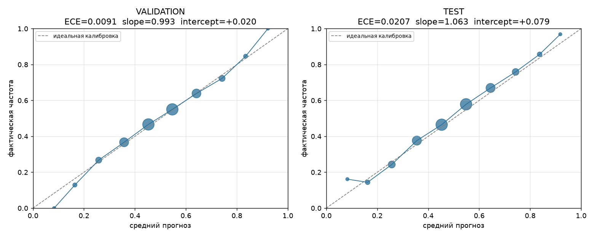

# PHASE 13 — аудит калибровки

> Сырые числа: `reports/experiments/phase13.json`.
> Метрики: `src/evaluation/calibration.py`, тесты на данных с известным
> ответом: `tests/ml/test_calibration_metrics.py` (10/10 PASS).
> Все разрезы построены на VALIDATION; TEST — одно обращение.

---

## 1. Метрики и почему именно они

| Метрика | Что ловит | Чего не ловит |
|---|---|---|
| **ECE** | среднее отклонение прогноза от факта, веса = размеры бинов | один маленький, но катастрофически плохой бин в нём тонет |
| **MCE** | худший бин (с порогом размера 30, иначе бин из пяти матчей объявит модель сломанной) | не показывает, насколько часто такое случается |
| **slope** | переуверенность (`<1`) или недоуверенность (`>1`) | не показывает систематический сдвиг |
| **intercept** | систематический сдвиг в пользу одного класса | не показывает форму |

Наклон считается ньютоновской логистической регрессией `y ~ a + b·logit(p)`
**без регуляризации**: штраф тянул бы наклон к нулю и объявлял бы хорошо
откалиброванную модель переуверенной. Проверено на синтетике: идеальная
калибровка даёт slope 1.00 ± 0.05, растянутые вдвое логиты — slope < 0.7.

---

## 2. Общий результат

| | VALIDATION | TEST |
|---|---:|---:|
| n | 16 463 | 16 464 |
| Accuracy | 0.6048 | 0.6301 |
| Log Loss | 0.6532 | 0.6390 |
| Brier | 0.2311 | 0.2244 |
| **ECE** | **0.0091** | **0.0207** |
| **MCE** | **0.0354** | **0.0784** |
| **slope** | **0.9932** | **1.0630** |
| **intercept** | **+0.0195** | **+0.0786** |

Значения Phase 12 (ECE 0.0091 / 0.0207) воспроизведены точно.

**Ответ на прямой вопрос задания.** Reliability curve на VALIDATION:

| Прогноз модели | Фактическая частота | n |
|---:|---:|---:|
| 0.258 | 0.267 | 976 |
| 0.358 | 0.367 | 2 570 |
| 0.453 | 0.466 | 4 409 |
| **0.547** | **0.550** | 4 431 |
| 0.642 | 0.639 | 2 492 |
| **0.742** | **0.723** | 992 |
| 0.834 | 0.846 | 273 |
| **0.922** | **1.000** | 11 |

Если модель говорит 55% — исход наступает в 55.0% случаев. Если 74% —
в 72.3%. Если 92% — бин содержит **11 матчей**, и любое число в нём
статистически бессмысленно. **Модель откалибрована в диапазоне, где у неё
вообще есть данные, то есть примерно 0.2–0.85.**

---

## 3. Разрез по годам

| Год | n | Accuracy | Log Loss | ECE | slope | intercept |
|---|---:|---:|---:|---:|---:|---:|
| 2024 | 11 898 | 0.5957 | 0.6605 | 0.0113 | 0.944 | +0.012 |
| 2025 | 4 565 | 0.6283 | 0.6341 | 0.0136 | 1.092 | +0.038 |

Наклон дрейфует с 0.944 до 1.092 — то есть в 2024 модель была слегка
переуверенной, в 2025 слегка недоуверенной. Обе величины близки к 1,
систематической поломки нет, но **калибровка не стационарна во времени**.
На TEST (2025-04 … 2026-08) наклон 1.063, intercept +0.079: модель
недооценивает победу Radiant.

Причина intercept видна прямо: базовая частота победы Radiant на TEST
выше, чем модель ожидает по обучению. Это дрейф базовой ставки, а не
дефект формы прогноза — и он лечится пересчётом свободного члена, а не
новыми признаками.

---

## 4. Фавориты против андердогов

| Сторона | n | Accuracy | ECE | slope | intercept |
|---|---:|---:|---:|---:|---:|
| фаворит (p>0.5) | 8 199 | 0.6085 | **0.0055** | **1.004** | −0.005 |
| андердог (p<0.5) | 8 264 | 0.6010 | 0.0127 | 1.117 | **+0.092** |

**Асимметрия есть.** На фаворитах калибровка практически идеальная. На
андердогах — наклон 1.117 и заметный сдвиг: модель **недооценивает шансы
слабой стороны**. Для продукта это конкретный вывод: прогноз «команда A
победит с вероятностью 30%» стоит читать как чуть большую вероятность,
чем написано.

---

## 5. Разрез по уверенности — здесь калибровка ломается

| \|p−0.5\| | n | Accuracy | ECE | **slope** |
|---|---:|---:|---:|---:|
| ≤ 0.02 | 1 978 | 0.4863 | 0.0235 | **−1.047** |
| 0.02–0.05 | 2 844 | 0.5302 | 0.0115 | 0.960 |
| 0.05–0.10 | 4 018 | 0.5777 | 0.0038 | 1.040 |
| 0.10–0.15 | 3 144 | 0.6116 | 0.0115 | 0.904 |
| > 0.15 | 4 479 | 0.7238 | 0.0160 | 1.011 |

В зоне почти равных прогнозов наклон **отрицательный**: внутри этого
интервала бóльшая вероятность соответствует слегка меньшей частоте.
Accuracy там 0.4863 — ниже случайного угадывания.

**Проверено интервалом, а не объявлено находкой.** Нижний дециль
уверенности: accuracy 0.4827, 95% CI **[0.4590, 0.5061]**. Интервал
включает 0.5, поэтому:

> **Инверсия НЕ доказана.** В зоне |p−0.5| < 0.02 модель не «ошибается
> систематически» — она просто **не несёт информации**. Порядок внутри
> этой зоны неотличим от случайного.

Это ровно тот вывод, который нужен продукту: near-coinflip прогнозы не
надо интерпретировать, их надо отбрасывать.

---

## 6. Калибровка после отказа — цена, о которой легко забыть

Селективный прогноз улучшает accuracy, но **портит калибровку**:

| Покрытие (VAL) | Accuracy | ECE |
|---:|---:|---:|
| 100% | 0.6048 | **0.0091** |
| 80% | 0.6320 | 0.0076 |
| 50% | 0.6715 | 0.0100 |
| 25% | 0.7298 | **0.0181** |
| 10% | 0.8039 | 0.0127 |

На TEST то же: ECE 0.0207 при полном покрытии и 0.0311 при 10%.

Причина механическая: отбираются матчи с крайними прогнозами, а именно
на краях распределения выборка мала и калибровка проверяется хуже всего.
**Отказ покупает дискриминацию за счёт качества вероятностей.** Для
продукта, где число интерпретируется буквально, это существенно.

---

## 7. Ответ: насколько хорошо модель откалибрована

**Хорошо — в рабочем диапазоне и в целом; с тремя оговорками.**

1. ECE 0.009 (VAL) и 0.021 (TEST), наклон в пределах 0.94–1.09 — это
   уровень, при котором вероятность можно показывать пользователю как
   число, а не как «условный рейтинг».
2. Калибровка **не стационарна**: наклон и сдвиг дрейфуют между годами,
   на TEST есть систематический сдвиг в пользу Radiant (+0.079).
   Периодическая перекалибровка свободного члена нужна.
3. Калибровка **неоднородна по подгруппам**: идеальна на фаворитах,
   смещена на андердогах, отсутствует как понятие в зоне |p−0.5| < 0.02.

Отдельно: **улучшать калибровку как способ поднять качество —
бесперспективно.** Phase 12 уже показала это, здесь подтверждено в
разрезах: запас в ECE составляет проценты, тогда как разрыв между
accuracy 0.63 и потолком лежит совсем в другом месте.
