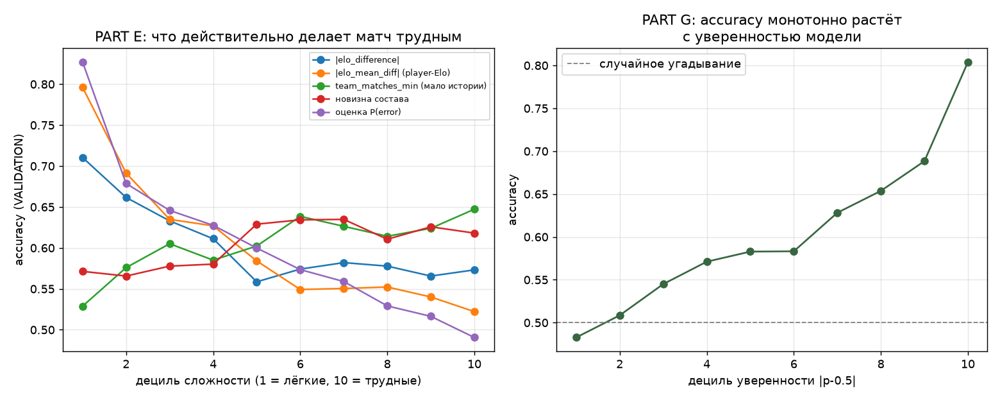

# PHASE 13 — анализ ошибок: что предсказывает ошибку модели

> Все результаты — на VALIDATION. Сырые числа: `reports/experiments/phase13.json`.

---

## 1. Как получены метки ошибки (важно для честности meta-модели)

Наивный путь — обучить meta-модель на ошибках, сделанных на TRAIN, — даёт
бесполезный результат: на обучающей выборке модель видела ответы, её
ошибки там нетипичны. Поэтому TRAIN разрезан хронологически:

```
TRAIN_ранний (70% TRAIN)  ->  обучается модель исхода
TRAIN_поздний (30%, 23 049 строк)  ->  собираются ошибки OUT-OF-SAMPLE
                                        и обучается meta-модель P(error)
VALIDATION (16 463)       ->  meta-модель оценивается
```

Доля ошибок: 0.3985 на meta-TRAIN, 0.3952 на VALIDATION — выборки
сопоставимы.

---

## 2. Что коррелирует с ошибкой (PART C)

| Ковариата | corr с ошибкой | AUC |
|---|---:|---:|
| **\|p−0.5\|** (уверенность самой модели) | **−0.183** | **0.398** → как предиктор 0.602 |
| team_matches_max | +0.074 | 0.532 |
| player_matches_min | +0.072 | 0.542 |
| player_matches_mean | +0.070 | 0.538 |
| team_matches_min | +0.066 | 0.534 |
| roster_matches_together_min | +0.058 | 0.540 |
| roster_age_days_min | +0.050 | 0.537 |
| days_since_transfer_min | +0.049 | 0.533 |
| days_since_patch | −0.048 | 0.474 |
| teammate_churn_max | −0.022 | 0.488 |
| new_players_max | −0.014 | 0.491 |
| players_with_new_teammates | −0.011 | 0.492 |
| hero_games_min | +0.006 | 0.502 |
| rare_heroes_count | +0.002 | 0.500 |

**Главная неожиданность — знак.** Все ковариаты «объёма данных» коррелируют
с ошибкой **положительно**: чем БОЛЬШЕ у команды истории, тем ЧАЩЕ модель
ошибается. Это противоположно интуиции «мало данных → плохой прогноз».

Разрез по децилям подтверждает (PART E):

| Дециль по `team_matches_min` | D1 (больше всего истории) | … | D10 (меньше всего) |
|---|---:|---|---:|
| Accuracy | **0.529** | … | **0.647** |

**Объяснение — не в модели, а в устройстве соревнований.** Команды с
длинной историей — это устоявшиеся топ-коллективы, которые играют друг с
другом в равных матчах высокого уровня. Команды с короткой историей
встречаются в квалификациях, где разрывы в силе огромны и исход
предсказуем. «Мало данных» здесь не мера незнания, а **прокси на
несбалансированность матча**.

Практический вывод: **объём данных нельзя использовать как признак риска.**
Он смешан с конкурентным балансом и работает в обратную сторону.

---

## 3. Meta-модель P(error) (PART D)

| Модель | Входы | **AUC на VALIDATION** |
|---|---|---:|
| M0 | только \|p−0.5\| | **0.6021** |
| M1 | только ковариаты неопределённости | 0.5308 |
| M2 | \|p−0.5\| + ковариаты | **0.6053** |
| M3 | negative control (шум) | 0.4913 |

**Ответ на вопрос PART D: да, ошибку можно предсказать заранее — но почти
исключительно через собственную уверенность модели.**

* Все шестнадцать ковариат вместе дают AUC 0.531 — против 0.491 у шума.
  Сигнал есть, но крошечный.
* Добавление всех ковариат к `|p−0.5|` поднимает AUC с 0.6021 до 0.6053,
  то есть **на 0.003**.

**Гипотеза G1 опровергнута.** Задание прямо предупреждало не считать
`|p−0.5|` достаточной мерой уверенности. Проверка показала обратное: для
этой модели `|p−0.5|` — практически исчерпывающая мера. Ни объём истории,
ни новизна состава, ни редкость героев, ни близость патча не добавляют к
ней сколько-нибудь заметной информации о риске ошибки.

---

## 4. Что действительно делает матч трудным (PART E)

Размах accuracy между крайними децилями:

| Определение сложности | D1 (лёгкие) | D10 (трудные) | Размах |
|---|---:|---:|---:|
| **оценка P(error)** | 0.825 | 0.481 | **+0.344** |
| **\|player-Elo gap\|** | 0.796 | 0.522 | **+0.274** |
| \|Elo gap\| (команды) | 0.710 | 0.573 | +0.137 |
| team_matches_min | 0.529 | 0.647 | **−0.118** (обратный знак) |
| новизна состава | 0.571 | 0.618 | **−0.047** (обратный знак) |

**Сложность матча определяется разницей в силе, и ничем больше.**
`player-Elo gap` вдвое сильнее командного Elo gap как индикатор — что
согласуется с Phase 9, где `elo_mean_diff` был признаком с наибольшим
коэффициентом.

P(error) даёт наибольший размах, но это частично круговая величина: она
построена главным образом на `|p−0.5|`, который сам выводится из тех же
разниц в силе.



---

## 5. Таксономия ошибок (PART F)

| Категория | n | доля | Accuracy | доля ошибок |
|---|---:|---:|---:|---:|
| 1. близкий матч (\|p−0.5\|<0.03) | 2 954 | 17.9% | **0.4932** | 0.507 |
| 2. явный фаворит (\|p−0.5\|>0.20) | 2 561 | 15.6% | **0.7599** | 0.240 |
| 3. мало данных (team_matches_min<20) | 5 045 | 30.6% | 0.6268 | 0.373 |
| 4. новый состав (≥1 замена) | 3 829 | 23.3% | 0.6247 | 0.375 |
| 5. новая команда (team_matches_min<5) | 2 160 | 13.1% | 0.6398 | 0.360 |
| 6. смена патча (<7 дней) | 820 | 5.0% | **0.5854** | 0.415 |
| 7. редкие герои (rare_heroes_count≥1) | **21** | 0.1% | 0.5714 | 0.429 |
| 8. верхний дециль P(error) | 1 647 | 10.0% | 0.4906 | 0.509 |
| 9. смена окружения (churn>0.5) | 1 901 | 11.5% | 0.6260 | 0.374 |

Две категории требуют оговорок.

* **Категория 7 вырождена**: к 2024 году у всех героев накоплена история,
  и «редких героев» в VALIDATION практически нет (21 матч из 16 463).
  Ковариата `rare_heroes_count` в этом периоде бесполезна не потому, что
  идея плоха, а потому что **явления нет в данных**.
* Категории 3, 4, 5, 9 показывают accuracy **выше** средней (0.6048).
  То есть «плохие условия» по всем интуитивным признакам дают лучшие,
  а не худшие прогнозы — см. раздел 2.

Реально выделяются только две категории, и обе определяются самой моделью:
близкий матч (0.493) и явный фаворит (0.760).

---

## 6. HIGH CONFIDENCE + WRONG — самый опасный тип ошибки

| | |
|---|---:|
| Уверенных прогнозов (\|p−0.5\| > 0.15) | 4 479 (27.2%) |
| Из них ошибочных | **1 237 (27.6%)** |

**Более чем каждый четвёртый уверенный прогноз ошибочен.** Это главный
продуктовый риск: именно эти матчи пользователь воспринимает как
«надёжные».

Профиль ошибочных уверенных прогнозов против верных уверенных:

| Ковариата | ошибочные | верные |
|---|---:|---:|
| team_matches_min | 240.6 | 173.2 |
| new_players_total | 0.90 | 0.85 |
| rare_heroes_count | 0.00 | 0.00 |
| days_since_patch | 78.6 | 83.1 |

Единственное различие — снова объём истории, и снова в «неправильную»
сторону: апсеты случаются в матчах между **хорошо изученными** командами.
То есть это апсеты в элитных сериях, а не следствие незнания.

**Отдельного механизма выявления high-confidence-wrong найти не удалось.**
Ни одна ковариата не отличает их от верных уверенных прогнозов достаточно,
чтобы на этом строить фильтр. Это отрицательный результат и он существенен:
уверенные ошибки — не следствие плохих данных, а следствие того, что
сильнейшая команда иногда проигрывает.

---

## 7. Сдвиг распределения (PART J)

Расстояние Махаланобиса до TRAIN-распределения (среднее и ковариация
считаются **только по TRAIN**, иначе VAL участвовал бы в определении
«обычного матча»).

| | |
|---|---:|
| Медиана расстояния на TRAIN | 1.815 |
| Медиана на VALIDATION | 1.900 |
| AUC расстояния как предиктора ошибки | **0.4375** |

| Дециль расстояния | D1 (близко) | D5 | D10 (далеко) |
|---|---:|---:|---:|
| Accuracy | 0.540 | 0.600 | **0.701** |

**Гипотеза G5 опровергнута, причём с обратным знаком.** Матчи, далёкие от
обучающего распределения, предсказываются **лучше**, а не хуже.

Причина прозрачна: расстояние доминируется величиной Elo-разницы.
Экстремальные значения признаков = сильно неравные команды = лёгкие
матчи. Дистанция до training-распределения в этой задаче измеряет не
незнакомость ситуации, а **неравенство сторон**.

Вывод: как детектор сдвига распределения эта величина непригодна.
Настоящий сдвиг (новые команды, новая мета) в ней не отделяется от
тривиального «сильный против слабого».

---

## 8. Разногласие моделей (PART N)

| Модель | Accuracy | Log Loss | ROC-AUC |
|---|---:|---:|---:|
| LogReg (Phase 9) | 0.6048 | 0.6532 | 0.6536 |
| CatBoost (те же входы) | 0.6062 | 0.6515 | 0.6559 |
| Ансамбль 50/50 | 0.6059 | 0.6519 | 0.6555 |

Разногласие `|LogReg − CatBoost|`: медиана 0.0147, 90-й перцентиль 0.0492.

**AUC разногласия как предиктора ошибки: 0.4919** — неотличимо от 0.5.
По квинтилям разногласия accuracy идёт 0.599 → 0.587 → 0.613 → 0.625 →
0.601, то есть немонотонно и без структуры.

**Гипотеза G6 опровергнута.** Идея «модели расходятся ⇒ матч неопределён»
на этих данных не работает. Правдоподобное объяснение: обе модели
обучены на одних и тех же пяти признаках, поэтому расходятся они там, где
различается форма их решающей функции, а не там, где мало информации.
Проверка этого объяснения потребовала бы моделей на разных наборах
входов и здесь не проводилась.

---

## 9. Дефект данных, обнаруженный в этой фазе

Ковариаты переходов игроков, опирающиеся на `team_id`, оказались
**загрязнены фрагментацией идентичности команд** (проблема, найденная
в Phase 10: 7 838 `team_id`, медиана 3 матча на команду).

Улики:

| | |
|---|---:|
| Матчей с ровно **5** «переходами» | 3 456 |
| Матчей с ровно **10** «переходами» | 1 219 |
| Медиана `days_since_transfer_min` | **3.77 дня** |

Пики ровно на 5 и 10 — это смена `team_id` целиком, а не переход игроков;
медиана «4 дня с последнего перехода» для профессиональной сцены
неправдоподобна.

Поэтому добавлена величина, **не зависящая от `team_id`**: смена
окружения определяется через множество партнёров игрока. Ключевой тест
(`test_teammate_churn_ignores_pure_team_id_change`) проверяет именно это:
та же пятёрка под другим `team_id` даёт 5 «переходов» по старой величине
и ровно 0 по новой.

Загрязнённые величины не удалены — они оставлены для сопоставимости и
помечены как дефект в коде и в отчёте.

---

## 10. Итог: что предсказывает ошибку модели

**Собственная уверенность модели — и практически ничего больше.**

* `|p−0.5|` даёт AUC 0.602 как предиктор ошибки.
* Все шестнадцать внешних ковариат вместе: 0.531 (шум: 0.491).
* Их добавление к `|p−0.5|`: +0.003 AUC.
* Разногласие ансамбля: 0.492 — сигнала нет.
* Расстояние до training-распределения: 0.438 — сигнал есть, но
  обратного знака и объясняется неравенством сторон.

Все интуитивные источники риска — мало данных, новый состав, переходы,
редкие герои — **либо не связаны с ошибкой, либо связаны в обратную
сторону из-за смешения с конкурентным балансом**.
