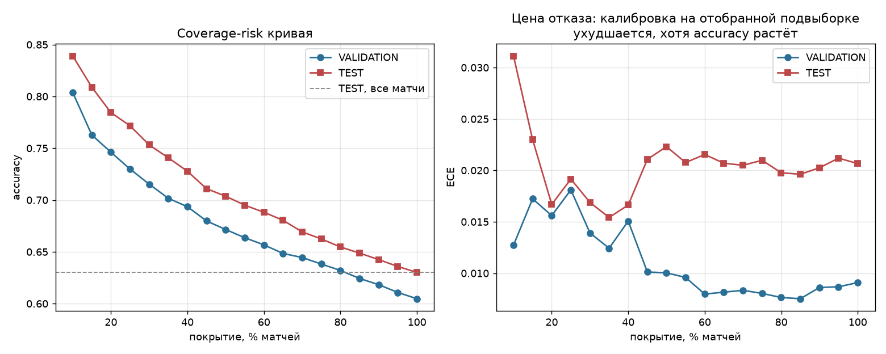

# PHASE 13 — селективный прогноз: coverage-risk и механизмы отказа

> Механизм отказа и пороги выбраны **на VALIDATION**. TEST — одно
> обращение. Сырые числа: `reports/experiments/phase13.json`.

---

## 1. Полная coverage-risk кривая

### VALIDATION

| Покрытие | n | Accuracy | Log Loss | Brier | ECE |
|---:|---:|---:|---:|---:|---:|
| 100% | 16 463 | 0.6048 | 0.6532 | 0.2311 | 0.0091 |
| 95% | 15 639 | 0.6108 | 0.6511 | 0.2301 | 0.0087 |
| **90%** | 14 816 | **0.6183** | 0.6487 | 0.2289 | 0.0086 |
| 85% | 13 993 | 0.6243 | 0.6461 | 0.2277 | 0.0075 |
| **80%** | 13 170 | **0.6320** | 0.6430 | 0.2262 | 0.0076 |
| 75% | 12 347 | 0.6382 | 0.6399 | 0.2248 | 0.0080 |
| **70%** | 11 524 | **0.6445** | 0.6365 | 0.2231 | 0.0083 |
| 65% | 10 701 | 0.6484 | 0.6333 | 0.2216 | 0.0082 |
| **60%** | 9 878 | **0.6567** | 0.6286 | 0.2195 | 0.0080 |
| 55% | 9 055 | 0.6636 | 0.6240 | 0.2173 | 0.0096 |
| **50%** | 8 232 | **0.6715** | 0.6185 | 0.2147 | 0.0100 |
| 45% | 7 408 | 0.6798 | 0.6123 | 0.2118 | 0.0101 |
| 40% | 6 585 | 0.6935 | 0.6030 | 0.2075 | 0.0151 |
| 35% | 5 762 | 0.7017 | 0.5954 | 0.2040 | 0.0124 |
| 30% | 4 939 | 0.7153 | 0.5838 | 0.1987 | 0.0139 |
| **25%** | 4 116 | **0.7298** | 0.5702 | 0.1925 | 0.0181 |
| 20% | 3 293 | 0.7461 | 0.5530 | 0.1848 | 0.0156 |
| 15% | 2 470 | 0.7628 | 0.5328 | 0.1760 | 0.0172 |
| 10% | 1 647 | 0.8039 | 0.4847 | 0.1547 | 0.0127 |

### TEST (механизм зафиксирован на VALIDATION, одно обращение)

| Покрытие | n | Accuracy | Log Loss | Brier | ECE |
|---:|---:|---:|---:|---:|---:|
| 100% | 16 464 | 0.6301 | 0.6390 | 0.2244 | 0.0207 |
| **90%** | 14 817 | **0.6425** | 0.6330 | 0.2216 | 0.0202 |
| **80%** | 13 171 | **0.6547** | 0.6260 | 0.2183 | 0.0198 |
| **70%** | 11 525 | **0.6692** | 0.6171 | 0.2141 | 0.0205 |
| **60%** | 9 878 | **0.6882** | 0.6053 | 0.2085 | 0.0215 |
| **50%** | 8 232 | **0.7037** | 0.5921 | 0.2025 | 0.0223 |
| **25%** | 4 116 | **0.7716** | 0.5283 | 0.1733 | 0.0192 |
| 10% | 1 647 | 0.8391 | 0.4403 | 0.1350 | 0.0311 |

Кривая гладкая и монотонная на обоих сплитах. Accuracy при 100% покрытия
на TEST выше, чем на VALIDATION (0.6301 против 0.6048) — TEST-период
объективно легче, поэтому **абсолютные значения VAL и TEST сравнивать
напрямую нельзя**, сравнимы только формы кривых.

---

## 2. Проверка на честность: те же ЧИСЛОВЫЕ пороги с VALIDATION

Кривая выше строится на квантилях TEST-скора. Более строгая проверка —
взять пороги, выбранные на VALIDATION, и применить их к TEST как есть:

| Цель по VAL | Порог | Покрытие на TEST | n | Accuracy |
|---:|---:|---:|---:|---:|
| 100% | — | 100.0% | 16 464 | 0.6301 |
| 90% | 0.0149 | 91.9% | 15 130 | 0.6404 |
| 80% | 0.0310 | 83.0% | 13 663 | 0.6514 |
| 70% | 0.0469 | 74.3% | 12 235 | 0.6631 |
| 60% | 0.0645 | 65.5% | 10 782 | 0.6785 |
| 50% | 0.0851 | 56.0% | 9 224 | 0.6930 |
| 25% | 0.1565 | 31.9% | 5 259 | 0.7479 |

Пороги переносятся, но покрытие систематически **выше** целевого
(56.0% вместо 50%, 31.9% вместо 25%): в TEST-периоде модель в среднем
увереннее. Для продукта это значит, что **порог нельзя фиксировать раз и
навсегда** — политику покрытия надо задавать в квантилях недавнего потока
матчей, а не абсолютным числом.

---

## 3. Сравнение механизмов отказа (PART I)

Пять механизмов, все — на VALIDATION:

| Механизм | acc@90% | acc@70% | acc@50% | acc@25% |
|---|---:|---:|---:|---:|
| A: \|p−0.5\| | 0.6183 | 0.6445 | 0.6715 | 0.7298 |
| B: −P(error) (meta-модель) | 0.6174 | 0.6445 | 0.6758 | 0.7349 |
| C: −разногласие моделей | 0.6059 | 0.6020 | 0.5927 | 0.5952 |
| **D: \|p_ens−0.5\|** (ансамбль) | 0.6172 | **0.6449** | **0.6766** | **0.7352** |
| E: композит \|p−0.5\|/(1+P(error)) | 0.6183 | 0.6441 | 0.6713 | 0.7298 |

**Выбран по VALIDATION: D (уверенность ансамбля LogReg+CatBoost).**

Но выигрыш надо назвать честно: **D превосходит простое `|p−0.5|` на
0.5 пп при 50% покрытия и на 0.5 пп при 25%.** Это меньше, чем разница
между VAL и TEST в целом.

Насколько A и B вообще различны, проверено напрямую: при покрытии 50%
они отбирают **одни и те же матчи в 90.7% случаев** (7 465 из 8 232).
На расходящихся 767 матчах A даёт accuracy 0.5528, B — 0.5984.
То есть преимущество meta-модели реально, но локализовано в ~9% решений.

**Механизм C провалился полностью** — при сужении покрытия accuracy не
растёт, а падает (0.6059 → 0.5927 → 0.5952). Разногласие моделей не
несёт информации об ошибке (см. `phase13-error-analysis.md`, раздел 8),
и отбор по нему хуже случайного.

### Рекомендация

**Для продукта разумно взять A (`|p−0.5|`), а не формального победителя D.**
Обоснование:

* разница 0.5 пп не окупает требования держать в продакшене две модели и
  ансамблировать их на каждом запросе;
* `|p−0.5|` не требует ничего, кроме самого прогноза, и не может
  рассинхронизироваться;
* meta-модель P(error) добавляет 0.003 AUC — её сложность не оправдана.

Это тот случай, когда «лучший по метрике» и «правильный инженерный
выбор» расходятся, и расхождение стоит зафиксировать, а не замаскировать
выбором победителя.

---

## 4. Максимальное полезное покрытие при заданной accuracy

Прямой ответ на вопрос PART H, по TEST-кривой:

| Целевая accuracy | Максимальное покрытие | n |
|---:|---:|---:|
| 0.65 | ~82% | ~13 500 |
| 0.68 | ~63% | ~10 400 |
| 0.70 | ~51% | ~8 400 |
| 0.75 | ~29% | ~4 800 |
| 0.80 | ~16% | ~2 600 |
| 0.84 | ~10% | ~1 650 |

Зависимость почти линейна в диапазоне 100%…30%: **каждые 10 пп
отброшенного покрытия дают примерно +1.5 пп accuracy.** Ниже 30%
кривая ускоряется.

---

## 5. Что отказ стоит

Три издержки, которые не видны в accuracy:

1. **Калибровка ухудшается.** ECE на TEST: 0.0207 при полном покрытии,
   0.0223 при 50%, 0.0311 при 10%. Отбираются матчи с крайними
   прогнозами, а на краях выборка мала.
2. **Покрытие не переносится.** Пороги с VALIDATION дали на TEST 56%
   вместо 50%.
3. **Отбрасываются не «плохие» матчи, а неинформативные.** В зоне
   |p−0.5| < 0.02 accuracy 0.4827 с CI [0.4590, 0.5061] — модель там не
   ошибается систематически, она просто не знает ничего. Отказ — это
   признание отсутствия информации, а не фильтрация брака.

---

## 6. Ответ на вопрос «можно ли построить production-grade confidence score»

**Да, и он уже есть — это `|p−0.5|`.**

* Accuracy монотонно растёт по всем десяти децилям уверенности
  (0.483 → 0.804 на VAL), без единого нарушения.
* Внутри каждого дециля калибровка сохраняется (наклон 0.90–1.04),
  кроме нижнего, где информации нет вовсе.
* Поведение воспроизвелось на TEST с порогами, выбранными на VALIDATION.

Чего построить **не** удалось: confidence score, который бы учитывал
внешние обстоятельства матча (объём данных, новизна состава, патч).
Все попытки дают прирост AUC порядка 0.003 — см. `phase13-error-analysis.md`.
