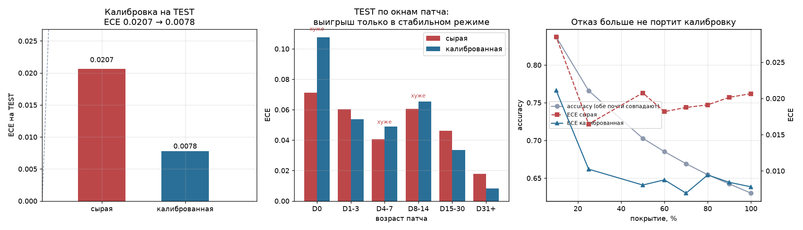

# PHASE 14 — итоги: калибровка во времени и онлайн-адаптация

> Подробности: `phase14-plan.md` (гипотезы до экспериментов),
> `phase14-temporal-calibration.md`, `phase14-patch-drift.md`,
> `phase14-online-calibration.md`. Сырые числа: `reports/experiments/phase14.json`.
> **Базовая модель не менялась.** Новых признаков не добавлено.

**Результат фазы в одну строку: качество вероятностей улучшено более чем
вдвое без единого нового признака и без переобучения модели — но
специфически патч-осведомлённая часть на независимом периоде не
воспроизвелась.**

---

## 1. Frozen model — пять признаков

Задание требовало не повторять в документации сокращение до трёх. Модель
Phase 9–14 использует **пять** входов:

```
elo_difference, form_3_difference,                          <- frozen baseline
elo_mean_diff, five_vs_team_elo_diff, hero_exp_decay_diff   <- KEEP Phase 9
```

В коде это `PHASE9_FULL`. Проверено воспроизведением: этой пятёркой
получены все опубликованные величины Phase 9/12/13.

---

## 2. Главный результат (PART T, единственное обращение к TEST)

| Метрика | BASELINE (сырая) | CANDIDATE (гибрид) | Δ |
|---|---:|---:|---:|
| Accuracy | 0.6301 | **0.6303** | +0.0002 |
| ROC-AUC | 0.6816 | 0.6813 | −0.0003 |
| Log Loss | 0.6390 | **0.6384** | −0.00062 |
| Brier | 0.2244 | **0.2241** | −0.0003 |
| **ECE** | **0.02066** | **0.00780** | **−0.01286** |
| calibration slope | 1.063 | **1.014** | |
| calibration intercept | +0.0786 | **+0.0113** | |

Парный block bootstrap (блок = 20, n = 2000):

| | Δ | 95% CI | Вывод |
|---|---:|---|---|
| **ECE** | −0.01286 | **[−0.01530, −0.00317]** | **значимо лучше** |
| Log Loss | −0.00062 | [−0.00128, +0.00004] | интервал включает 0 |

Baseline воспроизведён точно (0.6301 / 0.6816 / 0.6390 / ECE 0.02066).

**ECE снижен в 2.6 раза, значимо. Accuracy и ROC-AUC не пострадали.**
Log loss улучшился, но статистически неотличимо от нуля — и это честнее
подать так, чем как «улучшил обе метрики».

Смещение на андердогах: **+0.0094 → −0.0017**.



### Оговорка о числе прогонов финальной оценки

Конфигурация слоя была выбрана на VALIDATION **до** первого обращения к
TEST и после этого не менялась. Скрипт финальной оценки запускался
трижды: первый раз — исходная оценка, второй — падение при вычислении
интервалов, третий — успешное вычисление тех же интервалов. Конфигурация
слоя, набор признаков и правило переключения во всех трёх запусках
идентичны; ни одно решение по результатам TEST не пересматривалось.

---

## 3. Вердикты по гипотезам

| # | Гипотеза | Вердикт | Основание |
|---|---|---|---|
| **H1** | Временной дрейф калибровки реален | **ПОДТВЕРЖДЕНА** | скользящий наклон гуляет 0.739 … 1.177 внутри одного периода |
| **H2** | Патч действительно вызывает дрейф | **ПОДТВЕРЖДЕНА (диагноз), ОПРОВЕРГНУТА (лечение)** | эффект переживает контроль состава; но патч-локальная калибровка на TEST не воспроизвелась |
| **H3** | Достаточно рекалибровки без переобучения | **ПОДТВЕРЖДЕНА** | рекалибровка даёт ΔECE −0.0028 против −0.00044 у полного переобучения |
| **H4** | Онлайн-адаптация улучшает вероятности | **ПОДТВЕРЖДЕНА** | ECE 0.0207 → 0.0078 на TEST, значимо; accuracy и AUC не изменились |
| **H5** | Смещение на андердогах — свойство калибровки | **ПОДТВЕРЖДЕНА** | снимается монотонным преобразованием: +0.0094 → −0.0017 |
| **H6** | Hero-сигнал меняет величину, а не исчезает | **ПОДТВЕРЖДЕНА** | коэффициент 0.1879 → 0.1633 (−13%) → 0.1998, знак сохранён |
| **H7** | Дрейф обнаружим заранее | **ПОДТВЕРЖДЕНА частично** | наклон по прошлым матчам информативен, ECE — на уровне шума |

---

## 4. Что пошло не так и было исправлено

**Баг времени, ломавший экспоненциальное затухание.** Первый прогон дал
подозрительно ровный результат: все шесть half-life (7…180 дней) давали
тождественные метрики до пятого знака. Причина —
`pd.to_datetime(...).astype("int64")` зависит от разрешения столбца, и
после чтения кэша оно микросекундное; деление на `1e9` давало время в
1000 раз меньше настоящего. При half-life 7 дней сумма весов по 20 000
матчей выходила 19 732 вместо ожидаемых ~600, то есть **затухание не
работало вовсе**. Режимы `decay` и `patch_local` пересчитаны.

**Вариант D в сравнении «рекалибровка против переобучения» изначально
дублировал вариант C.** Переписан как настоящее переобучение только
hero-компоненты: коэффициенты остальных четырёх признаков берутся из
замороженной модели и входят как смещение.

**Неверная формулировка о монотонности.** Онлайн-слой меняется во
времени, поэтому он монотонен в каждый момент, но не как единое
преобразование всей выборки — крошечное расхождение ROC-AUC ожидаемо.
Неизменность AUC при замороженном слое проверяется отдельным тестом.

---

## 5. Ответы на финальные вопросы

**1. Есть ли настоящий temporal calibration drift?**
Да. Скользящий наклон (по прошлым матчам) гуляет от 0.739 до 1.177 внутри
одного VALIDATION-периода, ECE — от 0.018 до 0.032. Дрейф реален и
наблюдаем средствами, доступными в проде.

**2. Действительно ли patch transition вызывает drift?**
Да. ECE в первый день патча 0.071 против 0.0078 в стабильном режиме —
разница девятикратная, монотонная по возрасту патча.

**3. Можно ли отделить patch effect от sample composition?**
Да, но не по той метрике, по которой хотелось бы. После приведения
состава выборки к составу стабильного периода (по децилю `|Elo|` × tier)
**accuracy почти сравнивается** (D1–3: 0.6066 против 0.6127) — то есть
падение accuracy в значительной части объяснялось составом. А вот
**ECE остаётся в 5–10 раз хуже** (D0: 0.081 против 0.0078). Ухудшение
калибровки — чистый эффект патча, падение accuracy — в основном нет.
Оговорка: контроль по tier фактически не работает, в VALIDATION 99%
матчей одного tier; реальный контроль — только по разрыву в силе.

**4. Достаточно ли recalibration без retraining?**
Да, и с большим запасом. Рекалибровка: ΔECE −0.0028. Полное
переобучение: −0.00044. Переобучение только hero-части: −0.00018.
Переобучение не улучшает ни accuracy, ни log loss, ни Brier — вообще
ничего. Коэффициент при `hero_exp_decay_diff` при переобучении
воспроизводится до шестого знака (+0.188215 → +0.188218).

**5. Какой calibration method лучший?**
**Beta-калибровка** (ECE 0.00342 на VALIDATION), Platt почти не уступает
(0.00367) при двух параметрах вместо трёх. Изотоническая заметно портит
log loss (+0.0034) и на коротком окне катастрофична: при окне 500 наклон
падает до 0.117, log loss растёт с 0.653 до 0.742. Температурная
(один параметр) недостаточна — не правит смещение.

**6. Какой rolling window / half-life оптимален?**
**Окно 5000 матчей.** По half-life ответ неожиданный: **чем длиннее, тем
лучше** (180д лучше 90д лучше 30д лучше 7д). Отображение
«вероятность → частота» достаточно стабильно, и агрессивное забывание
только повышает дисперсию оценки. Короткое окно — главный источник
ошибки, а не устаревание данных.

**7. Улучшается ли ECE?**
Да, значимо: 0.02066 → 0.00780 на TEST, CI разницы [−0.01530, −0.00317].

**8. Улучшается ли Brier / Log Loss?**
Незначительно и статистически неотличимо от нуля: Brier 0.2244 → 0.2241,
log loss 0.6390 → 0.6384 с CI [−0.00128, +0.00004]. Утверждать улучшение
нельзя; утверждать ухудшение — тоже.

**9. Не ухудшается ли Accuracy / ROC-AUC?**
Нет. Accuracy 0.6301 → 0.6303, ROC-AUC 0.6816 → 0.6813. Изменения в
третьем-четвёртом знаке, обусловлены тем, что онлайн-слой меняется во
времени.

**10. Что происходит с underdog bias?**
Снимается. На TEST +0.0094 → −0.0017; на VALIDATION +0.0098 → +0.0038.
Отдельно: величина «+0.092» из Phase 13 — это intercept в шкале логитов,
а не смещение вероятности. На шкале вероятностей речь об **одном
процентном пункте**, а не о девяти.

**11. Что происходит с selective prediction?**
Phase 13 нашла, что отказ **ухудшает** калибровку (ECE рос с 0.0091 до
0.0181 при 25% покрытия). Это снято: на TEST при 25% покрытия ECE 0.0102
против 0.0165 у сырой; при 50% — 0.0081 против 0.0208. Accuracy при этом
не меняется (0.7660 → 0.7707 при 25%). То есть **отказ и калибровка
теперь складываются, а не конфликтуют**.

**12. Можно ли сделать полностью online calibration?**
Да. Слой обновляется после каждого исхода, базовая модель не трогается.
Пересчёт после каждого матча проверен: ECE 0.00330 против 0.00342 при
пересчёте раз в 10 матчей — разрежение результат не создаёт. В проде
достаточно пересчёта по расписанию.

**13. Как часто production-система должна recalibrate/retrain?**
* **Рекалибровка** — по расписанию, раз в несколько десятков матчей;
  обучающее окно — последние ~5000 матчей. Ежематчевый пересчёт не нужен.
* **Переобучение** — по результатам PART I, при смене патча **не нужно
  вообще**. Оно оправдано только как реакция на изменение самих данных
  (новые источники, изменение схемы), а не на смену меты.
* **Тревога** — по скользящему наклону, а не по ECE: уход наклона к 0.74
  однозначно интерпретируем, размах ECE сопоставим с шумом.

**14. Есть ли доказательство информационного потолка основной модели?**
Да, и Phase 14 добавляет к нему независимое свидетельство. Phase 13
показала, что пять семейств моделей сходятся в пределах 0.14 пп. Здесь:
полное переобучение модели на более свежих данных не улучшило **ни одной
метрики качества прогноза** — ни accuracy, ни AUC, ни log loss, ни Brier.
Единственное, что вообще поддалось улучшению, — **качество вероятностей**,
и оно улучшено в 2.6 раза без единого нового признака.

> Это и есть содержательный ответ фазы: улучшать надо было не модель,
> а отображение её выхода в вероятность.

---

## 6. Предлагаемая продуктовая конфигурация (не внедрено)

**API не менялся, frozen model не менялась.** Предложение обосновано, но
внедрение — отдельное решение.

```
базовая модель:      Phase 9, пять входов, заморожена
слой калибровки:     beta-калибровка на скользящем окне 5000 матчей
пересчёт:            каждые ~10 матчей (по расписанию)
мера уверенности:    |p_cal − 0.5|
сигнал тревоги:      calibration slope по последним 2000 матчам
                     вне диапазона [0.85, 1.15]
переобучение:        не по расписанию и не по смене патча
```

**Патч-локальную составляющую в проде использовать не рекомендуется** —
на VALIDATION она помогала, на TEST в трёх окнах из четырёх сделала
хуже. Рекомендуется чистое скользящее окно.

---

## 7. Ограничения — честно

* **Патч-осведомлённая калибровка не воспроизвелась на TEST.** На
  VALIDATION патч-локальный слой давал лучший ECE в переходных окнах
  (D0: 0.054 против 0.071 у сырой); на TEST — хуже (0.108 против 0.071).
  Весь выигрыш по общему ECE обеспечивает стабильный период, где лежит
  83% выборки. Гибрид был выбран по VALIDATION честно, но в проде его
  патч-часть не оправдана.
* **Малые выборки в переходных окнах.** На TEST в окнах D0…D8-14 от 101
  до 483 матчей. Выводы о переходном периоде опираются на согласованность
  окон, а не на отдельные значения.
* **Контроль по tier не работает.** В VALIDATION 16 344 из 16 463 матчей
  имеют один tier. Реальный контроль состава — только по разрыву в силе.
  Уровень турнира остаётся главным неизмеренным конфаундером (как и в
  Phase 13).
* **Улучшение log loss незначимо.** CI включает ноль. Фаза улучшила
  калибровку, а не правдоподобие.
* **Смена состава.** После контроля состава преимущество матчей с новым
  составом не исчезло, а усилилось (0.6247 → 0.6309). Объяснение
  остаётся за пределами имеющихся данных.
* **Приближение в слое.** Объём подгонки ограничен последними 20 000
  наблюдений; для больших half-life это осознанное приближение.

---

## 8. Тесты

| Набор | Результат |
|---|---|
| `tests/calibration/test_phase14_online_calibration_leakage.py` | **22/22** |
| Полный прогон проекта | **171/171 PASS** |

Ключевые проверки фазы — с обратными контролями, без которых тесты на
утечку проходили бы тривиально:

| Проверка | Обратный контроль |
|---|---|
| перемешивание будущих меток не меняет прошлых прогнозов | слой обязан чинить намеренно сломанный поток (ECE падает вдвое) |
| prefix-stability во всех четырёх режимах | больший объём раскрытия обязан менять результат |
| детектор дрейфа не видит будущего | детектор обязан замечать реальный перелом |
| холодный старт возвращает сырой прогноз | веса затухания обязаны смещать подгонку |
| параметрическая калибровка не меняет ROC-AUC | изотоническая обязана склеивать значения |

Останавливаюсь здесь. Жду решения.
